<properties 
	pageTitle="Developer Notes for Azure in China Applications"
	description="Introduce developerment differences in application between China Azure and Global Azure" 
	metaKeywords="China Azure, Developer Notes, Global Azure, Visual Studio, Resource Endpoint URI, Guidance, Cloud Services, Active Directory, Service Bus, Azure PowerShell, Azure CLI, Azure SDK"
	metaCanonical="" 
	services="" 
	documentationCenter="develop"  
	authors="" 
	solutions="" 
	manager="TK" 
	editor=""/>
<tags ms.service="multiple" ms.date="" wacn.date="11/18/2016"/>

# Developer Notes for Azure in China Applications

## About this Document

Microsoft provides tools to create and deploy cloud applications to Microsoft’s global Azure service (“Global Service”).

Azure in China (“China Service”) is a separate instance of the Azure service operated and provided by a Chinese company, 21Vianet, from data centers located in the People’s Republic of China (excluding Hong Kong, Macau, and Taiwan). Therefore, when creating and deploying applications to as opposed to Global Service, developers need to know the key differences of the two services, when setting up their programming environment, writing applications, and deploying them as services hosted in China.

The information in this document summarizes those differences and supplements the information available on the Chinese [Azure portal](https://www.azure.cn). Official information may also be available in many other locations such as the Windows Azure [posterand](http://www.microsoft.com/zh-cn/download/details.aspx?id=35473) and in various blog posts by Microsoft employees. This content is intended for partners and developers who are deploying in China to the Datacenters hosted in China.

For the latest update on feature availability for the China service, please visit the Chinese [Azure portal](https://www.azure.cn). For a list of the current content assets on Azure, please see the [Appendix]((#appendix)) in this document.

## Providing Guidance to Developers

Because most of the English technical content that is available from Microsoft currently assumes that applications are being developed for the Global Service rather than for China Service, it’s important for you to ensure that developers are aware of key differences for applications developed to be hosted in China.

First, there are feature differences, which mean that certain features that are in Global Service are not available in China.

Second, for features that are offered in China, there are operating differences which means that to consume publicly available English content (that are written for Global Service), you should customize any sample code and steps as needed.

## Datacenters in China

Currently there are two datacenters operated by China Service. The two datacenters show up as “China North” and “China East” in the location field.

## Overview of Differences When Creating an Application on China Service

A primary difference when developing an application on China Service is that there are different URIs for endpoint addresses. For example, Azure and SQL Database URIs normally end with windows.net. China Service developers must be able to recognize when URI endpoints differ, and then configure the tools that they use and the applications that they develop to use URIs for these different endpoints as appropriate.

## Setting Up Your Development Computer

Visual Studio supports development on Azure China. The walkthrough uses Visual Studio 2015 update 3. [Downloads | Visual Studio Official Site](https://www.visualstudio.com/downloads/)

## Setup Visual Studio for connecting to Azure China

Follow the instructions to setup your Visual Studio for Azure China:

1. Use the Reg key files here:

    Azure.reg

        Windows Registry Editor Version 5.00

        [HKEY_CURRENT_USER\Software\Microsoft\VSCommon\ConnectedUser]
        "AadInstance"="https://login.chinacloudapi.cn/"
        "adaluri"="https://management.core.chinacloudapi.cn"
        "AzureRMEndpoint"="https://management.chinacloudapi.cn"
        "AzureRMAudienceEndpoint"="https://management.core.chinacloudapi.cn"
        "EnableAzureRMIdentity"="true"
        "GraphUrl"="graph.chinacloudapi.cn"

    To flip the Reg values back to target public Azure, use the Reg key file here:

    TargetProduction.reg

        [HKEY_CURRENT_USER\Software\Microsoft\VSCommon\ConnectedUser]
        "Uri"=-
        "AadInstance"=-
        "adaluri"=-
        "AzureRMEndpoint"=-
        "AzureRMAudienceEndpoint"=-
        "EnableAzureRMIdentity"=-
        "GraphUrl"=-
        "AadApplicationTenant"=-

        [HKEY_CURRENT_USER\SOFTWARE\Microsoft\VisualStudio\14.0\MicrosoftAzureServices]
        "Resource Management Audience Endpoint"=-
        "Service Management Endpoint"=-

2. Double click the Azure.reg file and consent to the pop up messages to allow the registry value changes.

3. After the registry values changed, all Visual Studio sign-in should connect to Azure China service.

## Examples of scenarios enabled

### Cloud Explorer

1. Follow instruction to enter your credentials

    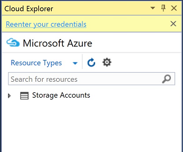
 
2. Enter your login information

    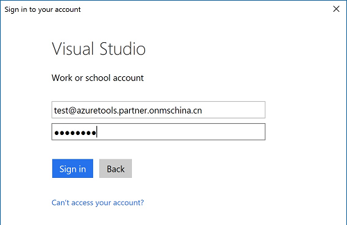
 
3. View your resources in Azure China subscription from Cloud Explorer

    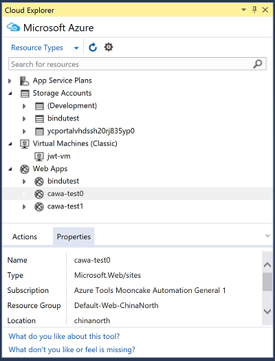

 
### Publish Web Application

1.	Launch publish dialog from context menu.

    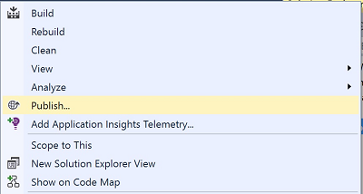
 
2.	Choose Microsoft Azure App Service.

    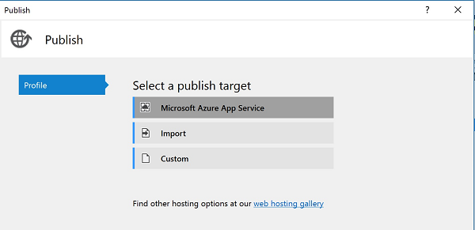
 
3.	Select your Azure China account from Account picker

	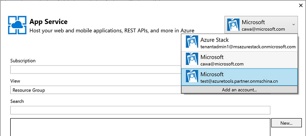
	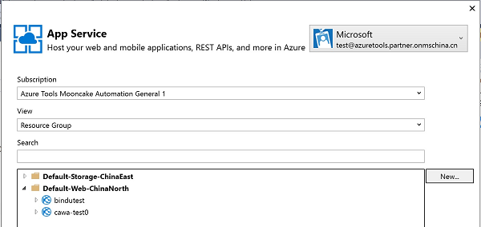
	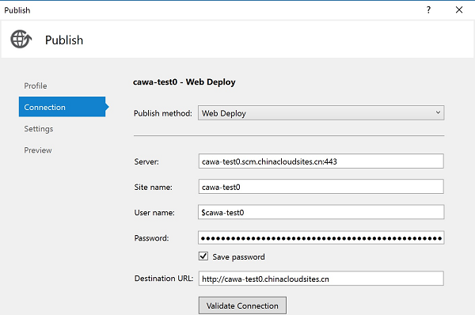

 
### Azure Resource Manager tools
1.	Launch the deployment dialog from context menu.

	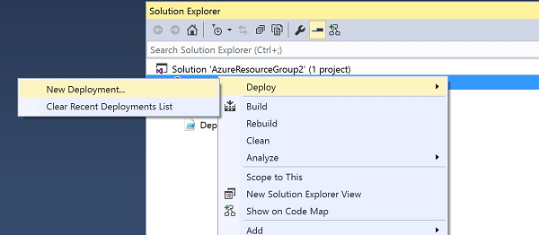

2.	Select the Azure China account from account picker.

	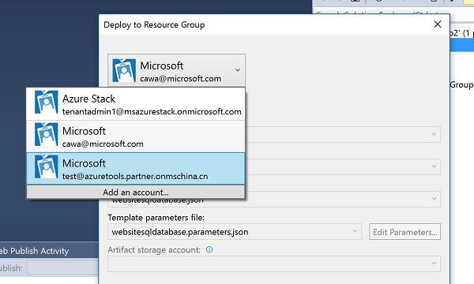
 
3.	Some resources that are not supported on Azure China yet but present in the Resource template are indicated with warning.

	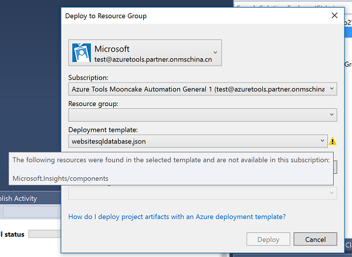
 
4.	Edit the Template parameters and proceed with deployment

All other features would work in a similar way.

## Azure China Resource Endpoint URIs Used in Application Code

URIs are different from public Azure in Azure China. Users need to make sure the application code and configuration files use appropriate connection strings with Azure China endpoint. Note that the connection strings generated by Visual Studio will automatically use the China Service URI for each resource if Visual Studio is connected to an Azure China subscription.

### Endpoint Mapping

Use the following table to guide you when mapping public Azure resources endpoints to China specific endpoints.

Service Type|Global Service URI|China Service URI
:--|:--|:--
Azure - General | *.windows.net | *.chinacloudapi.cn
Azure - Compute | *.cloudapp.net | *.chinacloudapp.cn  
Azure - Service Fabric Cluster | *.cloudapp.azure.com | *.chinaeast.chinacloudapp.cn
Azure - Storage | 
\*.blob.core.windows.net 
 
\*.queue.core.windows.net 
 
\*.table.core.windows.net
 | 
*.blob.core.chinacloudapi.cn 

 *.queue.core.chinacloudapi.cn 

 *.table.core.chinacloudapi.cn

Azure - Service Management | https://management.core.windows.net | https://management.core.chinacloudapi.cn
Azure - Resoure Manager (ARM) | https://management.azure.com | https://management.chinacloudapi.cn
SQL Database | *.database.windows.net | *.database.chinacloudapi.cn
Azure - Management Portal | 
http://manage.windowsazure.com

https://portal.azure.com
 | 
https://manage.windowsazure.cn

https://portal.azure.cn

SQL Azure Database Management API | https://management.database.windows.net | https://management.database.chinacloudapi.cn
Service Bus | *.servicebus.windows.net | *.servicebus.chinacloudapi.cn
ACS | *.accesscontrol.windows.net | *.accesscontrol.chinacloudapi.cn
HDInsight | *.azurehdinsight.net | *.azurehdinsight.cn
MySQL Paas | - | *.mysqldb.chinacloudapi.cn
Azure PowerShell Login (Classic, Azure Service Management) | Add-AzureAccount | Add-AzureAccount -Environment AzureChinaCloud
Azure PowerShell Login (Azure Resoure Manager) | Add-AzureRmAccount | Add-AzureRmAccount -EnvironmentName AzureChinaCloud
AAD | *.onmicrosoft.com | *.partner.onmschina.cn
AAD PowerShell Login | Connect-msolservice| Connect-msolservice -AzureEnvironment AzureChinaCloud
AAD Login | https://login.windows.net| https://login.chinacloudapi.cn
AAD Graph API | https://graph.windows.net| https://graph.chinacloudapi.cn
Azure 认知服务 | https://api.projectoxford.ai/face/v1.0 | https://api.cognitive.azure.cn/face/v1.0
SQL Database Import/Export service mapping endpoints | | 
1. China East: [https://sh1prod-dacsvc.chinacloudapp.cn/dacwebservice.svc](https://sh1prod-dacsvc.chinacloudapp.cn/dacwebservice.svc) 

 2. China North:[https://bj1prod-dacsvc.chinacloudapp.cn/dacwebservice.svc](https://bj1prod-dacsvc.chinacloudapp.cn/dacwebservice.svc)

### Storage endpoints

You must use custom storage endpoints. The default settings point to `*.core.windows.net`. The * changes based on your application and storage location.

For example, in the service configuration file (.cscfg) for your Cloud Services application, set up a custom data connection string to point to the blob, queue, and table storage URIs in China Service. The following code shows an example of a custom endpoint where `<AccountKey>` is a variable that must be replaced by your specific storage Account Key. The string mystorageaccount is an example of a storage account created under a subscription.

    <Setting name="DataConnectionString" value=
    "BlobEndpoint=https://mystorageaccount.blob.core.chinacloudapi.cn/;QueueEndpoint=https://mystorageaccount.queue.core.chinacloudapi.cn/;TableEndpoint=https://mystorageaccount.table.core.chinacloudapi.cn/;AccountName=mystorageaccount;AccountKey=<AccountKey> " />

### To create a custom endpoint in Visual Studio 

In Cloud Services application, you can create custom endpoints for connection strings:

1. Open a Windows Azure solution containing one or more roles.
2. Right-Click any role in the Solution Explorer. This brings up the configuration for that role.
3. Click Settings.
4. Click Add Setting.
5. Type in a Name for your setting.
6. Choose a Type of Connection String.
7. Click … to bring up the Storage Account Connection String dialog box.
8. Choose Enter storage account credentials.
9. Enter the proper storage account name and key.
10. Choose Use custom endpoints and enter the proper https strings for the blob, table and queue endpoints.
11. Click OK.

Visual Studio creates a custom storage endpoint in your service configuration file. You can use this storage endpoint from the code in your role.

The following code show programmatically connecting to a storage account by using custom URI specific to China Service.

    CloudStorageAccount Account = new CloudStorageAccount( 
    new StorageCredentialsAccountAndKey(ACCOUNTNAME, ACCOUNTKEY), 
    new Uri("http:// ACCOUNTNAME.blob.core.chinacloudapi.cn/"), 
    new Uri("http:// ACCOUNTNAME.queue.core.chinacloudapi.cn/"), 
    new Uri("http:// ACCOUNTNAME.table.core.chinacloudapi.cn/")
    );
    CloudBlobClient BlobClient = Account.CreateCloudBlobClient(); 

## Port Bindings in Cloud Services applications

Port bindings also use DNS names that end in `*.cloudapp.net`. You must change these to point to `*.chinacloudapp.cn`. Part of a service definition file including a port declaration is shown below.

    <Sites>
    <Site name="MySite" physcalDirectory="..\WebSite1">
        <Bindings>
            <Binding name="My" endpointName="HttpIn" hostHeader="WebSite1.mysite.Chinacloudapp.cn" /> 
        </Bindings>
    </Site>
    <Site name="Web">
        <Bindings>
            <Binding name="HttpIn" endpointName="HttpIn" />
        </Bindings>
    </Site>
    </Sites>

## Connections to SQL Database Servers

SQL Database server names will change from `*.database.windows.net` to `*.devdatabase.chinacloudapi.cn`. Any client application or tool must use the new name for its connection string to connect to the databases. References to SQL Database servers could be DataConnectionString values in service definition files or values in other .NET configuration files for applications not running in China Service. For example:

    <configuration>
    <connectionStrings>
        <add name="SQLAzure" connectionString="Server=tcp:yourserver.devdatabase.chinacloudapi.cn;
    Database=Test;User ID=login@server;Password=yourPassword;
    Trusted_Connection=False;Encrypt=True;"/>
    </connectionStrings>
    </configuration>

## Active Directory and Service Bus

### Active Directory

Azure Active Directory (AAD) provides identity and access features for on-premises and cloud applications. Developers can use features of AAD to implement single sign-on and single sign-off for enterprise applications and software as a service (SaaS) providers, use the Graph API to query and manage cloud directory objects, and integrate with on-premises Active Directory to sync directory data to the cloud.

AAD is included in Azure operated by China Service. However, by design, there are a few difference that affect the developer experience. This article describes those differences.

China Service is a customized product that shares many features with the global Service. The customization resulted in the following differences that affect developers who use AAD.

- Access Control namespaces are not available. To integrate applications and synchronize directories with Azure identity services, use AAD. In the Windows Azure Management Portal, click Active Directory.
- The ACS Management Portal is available only for Service Bus namespaces.
- Other than these customizations, AAD in China Service is designed to be the same as the global service.

>[AZURE.NOTE]Access Control namespaces that were created during the preview of Azure operated by China Service are not operational or accessible. However, similar features are available in the Active Directory section of the Azure Management Portal.

### Service Bus Configuration

If you are using Shared Access Signature (SAS) to connect to Service Bus, changing the endpoint in the project configuration file is sufficient.

If you are using Access Control Service (ACS) to connect to Service Bus, you can redirect applications using Service Bus to specific endpoints using one of the following methods:

* Option 1: Use environment variables to redirect individual or all applications.
* Option 2: Use a ServiceBus.config file to redirect individual applications.
* Option 3: Use a ServiceBus.config file to redirect all applications.

If you are running an EXE file or worker role, any of the options will work. If you are using a web role, only option 3 is possible.

Regardless of the method, the endpoint names will change as shown in the table below.

<table border="1" cellspacing="0" cellpadding="0">
  <thead>
    <tr>
      <td width="295" valign="top" bgcolor="#D9D9D9"> Service Bus endpoint </td>
      <td width="295" valign="top" bgcolor="#D9D9D9"> Equivalent Windows Azure in China Service Bus Endpoint </td>
    </tr>
  </thead>
  <tbody>
    <tr>
      <td width="295" valign="top"> servicebus.windows.net </td>
      <td width="295" valign="top"> servicebus.chinacloudapi.cn </td>
    </tr>
    <tr>
      <td width="295" valign="top"> accesscontrol.windows.net </td>
      <td width="295" valign="top"> accesscontrol.chinacloudapi.cn </td>
    </tr>
  </tbody>
</table>

#### Option 1: To redirect by using environment variables
1. Consider what level to set the variables. Setting the environment variables for the entire computer, a user or an environment running a single application has different implications.
2. Set the following environment variables at the appropriate level:
 
        RELAYHOST=servicebus.chinacloudapi.cn
        STSHOST=accesscontrol.chinacloudapi.cn 
        RELAYENV=Custom

>[AZURE.WARNING]This option will not work for Cloud Services projects when adding environment variables through the `<environment>` tag in the csdef file for a web role. The web role runs in the context of w3wp.exe. Environment variables are not propagated to the w3wp.exe environment. See option 3 for web roles.

#### Option 2: to redirect individual applications by using a ServiceBus.config file

1. Create a ServiceBus.config file with the following content with the appropriate host information.

        <?xml version="1.0" encoding="utf-8"?>
        <configuration>
        <Microsoft.ServiceBus>
            <relayHostName>servicebus. chinacloudapi.cn</relayHostName>
            <stsHostName>accesscontrol. chinacloudapi.cn</stsHostName>    
        </Microsoft.ServiceBus>
        </configuration>

2. Place the ServiceBus.config file in the same directory as the .exe file of the Service Bus/ACS application.

    This option will not work for Cloud Services web roles because they run in the context of w3wp.exe. As a result, the system looks for the servicebus.config file in the %Windir%\System32\inetsrv\ where is does not exist.

#### Option 3: To redirect all applications by using a ServiceBus.config file

1.	Look .NET Framework configuration directory for an existing ServiceBus.config file. The .NET Framework configuration directory depends on the operating system version being 32-bit or 64-bit and the framework version that you have installed, below are the typical locations.

	<table border="1" cellspacing="0" cellpadding="0">
	  <thead>
	    <tr>
	      <td width="199" valign="top" bgcolor="#D9D9D9"> Microsoft .NET Framework version </td>
	      <td width="178" valign="top" bgcolor="#D9D9D9"> Operating System version </td>
	      <td width="188" valign="top" bgcolor="#D9D9D9"> Directory </td>
	    </tr>
	  </thead>
	  <tbody>
	    <tr>
	      <td width="199" valign="top"> 2.0 to 3.5 </td>
	      <td width="178" valign="top"> 32-bit </td>
	      <td width="188" valign="top"> %Windir%\Microsoft.NET\Framework\v2.0.50727\CONFIG </td>
	    </tr>
	    <tr>
	      <td width="199" valign="top"> 2.0 to 3.5 </td>
	      <td width="178" valign="top"> 64-bit </td>
	      <td width="188" valign="top"> %Windir%\Microsoft.NET\Framework64\v2.0.50727\CONFIG </td>
	    </tr>
	    <tr>
	      <td width="199" valign="top"> 4.0 </td>
	      <td width="178" valign="top"> 32-bit </td>
	      <td width="188" valign="top"> %Windir%\Microsoft.NET\Framework\v4.0.30319\Config </td>
	    </tr>
	    <tr>
	      <td width="199" valign="top"> 4.0 </td>
	      <td width="178" valign="top"> 64-bit </td>
	      <td width="188" valign="top"> %Windir%\Microsoft.NET\Framework64\v4.0.30319\Config </td>
	    </tr>
	  </tbody>
	</table>  

2. If there is an existing ServiceBus.config file in the directory, you must edit it to add the XML configuration outlined in Option 2 (individual redirect using ServiceBus.config). If adding that configuration would conflict with information already in the existing ServiceBus.config file, then you cannot use this option. You must use option 1 or 2.

It is not possible to target a specific framework directory unless you know the framework the role is using. However, the script below generalizes the copying process with web roles. It will copy a servicebus.config file into each .NET directory if it exists.

    @echo off
    pushd .
    cd %windir%\Microsoft.Net\Framework64\
    REM set copylocal=true on servicebus.config so its present in bin dir
    for /f %%i in ('dir /s /b config') do copy /y %~dp0servicebus.config %%~fi
    popd

## Using the Service Management API

The Service Management API allows developers to manage the deployment of hosted services running in Windows Azure. In fact, the Management Portals for both Global Service and China Service use the Service Management API.

Global Service：<a href="https://management.core.windows.net">https://management.core.windows.net</a>。China Service：
  <a href="https://management.core.chinacloudapi.cn">https://management.core.chinacloudapi.cn</a>。

## Redirecting Custom Domain Names to Your Hosted Service in China Service

If you are using a custom domain name forwarded to a hosted service running in Global Service and you move that hosted service to China Service, you must update the forwarded domains to point to the new China specific endpoint.

For example, if www.contoso.com is being re-directed to a web role running at contoso.cloudapp.net, it will now have to be re-directed to contoso.chinacloudapp.cn.

## Using Azure Diagnostics

Azure Diagnostics uses either local storage on your development computer or an China Service storage account to store diagnostic information. 

Add the following configuration information in your *.cscfg file:

    <ConfigurationSettings>
    <Setting name="Microsoft.WindowsAzure.Plugins.Diagnostics.ConnectionString" value="<YourStorageString>" />
    </ConfigurationSettings>

The value `<YourStorageString>` is a custom endpoint and incorporates the URI for China Service.

## Re-issuing Certificates for HTTPS Endpoints

No certificate changes are required when using custom domain names.

If any existing applications use HTTPS endpoints and the certificates are bound to `https://*.cloudapp.net` (where * is the name of your service), these certificates will have to be re-issued for `*.chinacloudapp.cn`. You must use these new certificates when deploying the service in China.

## Using Azure PowerShell 

Type the following in a PowerShell console to sign-in to Azure China Cloud:
- ASM mode:

        Add-AzureAccount -Environment AzureChinaCloud

- ARM mode:

        Login-AzureRmAccount -EnvironmentName AzureChinaCloud

## Using Azure CLI

Type the following in a command prompt to sign-in to Azure China Cloud:

    azure login -e AzureChinaCloud

## Using Azure SDK for Node.js

To use the SDK with China Service, supply connection strings either from the management portal, or via the CLI.

### Storage, Service Bus and Notification Hubs

All of these accept a respective connection string, you can get the value either from the management portal or using the CLI.

    var tableService = azure.createTableService(storageConn);
    var blobService= azure.createBlobService(storageConn);
    var queueService = azure.createQueueService(storageConn);
    var serviceBusService = azure.createServiceBusService(sbConn);
    var notificationHubService = azure.createNotificationHubService(nhConn);

### SQL

For managing SQL Database servers, you use this configuration:

    var sqlManagementService = azure.createSqlManagementService(subscriptionId, authentication, hostOptions);

## Appendix: Content Repository for Azure

The following lists all the content assets available for Windows Azure today, and indicate whether the asset is specifically talking about China Service.

<table border="1" cellspacing="0" cellpadding="0">
  <tbody>
    <tr>
      <td width="130" valign="top"><strong>Asset</strong></td>
      <td width="180" valign="top"><strong>Content is specifically created for China</strong></td>
      <td width="794" valign="top"><strong>Description</strong></td>
    </tr>
    <tr>
      <td width="130" valign="top">azure.microsoft.com</td>
      <td width="180" valign="top"> no </td>
      <td width="794" valign="top"> Global portal for Microsoft Azure。 </td>
    </tr>
    <tr>
      <td width="130" valign="top"> azure.cn </td>
      <td width="180" valign="top"> yes </td>
      <td width="794" valign="top"> Portal built specifically for Microsoft Azure operated in China  </td>
    </tr>
    <tr>
      <td width="130" valign="top"> Azure case studies globally </td>
      <td width="180" valign="top"> no </td>
      <td width="794" valign="top"><a href="http://azure.microsoft.com/zh-cn/case-studies/">http://azure.microsoft.com/zh-cn/case-studies/</a></td>
    </tr>
    <tr>
      <td width="130" valign="top"> Azure case studies in China </td>
      <td width="180" valign="top"> yes </td>
      <td><a href="/partnerancasestudy/case-studies/">https://www.azure.cn/partnerancasestudy/case-studies/</a></td>
    </tr>
    <tr>
      <td width="130" valign="top"> P&amp;P series of books </td>
      <td width="180" valign="top"> no </td>
      <td width="794" valign="top"><ul>
          <li><a href="http://www.amazon.cn/%E5%BE%AE%E8%BD%AF%E4%BA%91%E8%AE%A1%E7%AE%97%E7%B3%BB%E5%88%97%E4%B8%9B%E4%B9%A6-%E4%BA%91%E8%BF%81%E7%A7%BB%E6%8A%80%E6%9C%AF-%E8%B4%9D%E8%8C%A8/dp/B00C8JDM10/" target="_blank">Moving Applications to the Cloud on Microsoft Windows Azure</a></li>
          <li><a href="http://www.amazon.cn/%E6%9E%84%E5%BB%BA%E5%BC%B9%E6%80%A7%E4%BA%91%E5%BA%94%E7%94%A8-Dominic-Betts/dp/B00C8JDGRA/ref=pd_sim_b_2" target="_blank">Building Elastic and Resilient Cloud Applications</a></li>
          <li><a href="http://www.amazon.cn/%E4%BA%91%E5%BA%94%E7%94%A8%E5%BC%80%E5%8F%91-Dominic-Betts/dp/B00C8JDO68/ref=sr_1_10?ie=UTF8&amp;qid=1370328786&amp;sr=8-10&amp;keywords=azure" target="_blank">Developing Applications For the Cloud on Microsoft Windows Azure </a></li>
        </ul></td>
    </tr>
    <tr>
      <td width="130" valign="top"> Books by MVP </td>
      <td width="180" valign="top"> no </td>
    </tr>
    <tr>
      <td width="130" valign="top"> MSDN Library </td>
      <td width="180" valign="top"> yes and no </td>
      <td width="794" valign="top"><a href="https://msdn.microsoft.com/library/azure/">https://msdn.microsoft.com/library/azure/</a></td>
    </tr>
    <tr>
      <td width="130" valign="top"> Azure team blogs </td>
      <td width="180" valign="top"> yes and no </td>
      <td width="794" valign="top"><a href="http://blogs.msdn.com/b/azchina/">http://blogs.msdn.com/b/azchina/</a></td>
    </tr>
    <tr>
      <td width="130" valign="top"> MSDN Azure portal </td>
      <td width="180" valign="top"> no </td>
      <td width="794" valign="top"><a href="http://msdn.microsoft.com/zh-cn/ff380142">http://msdn.microsoft.com/zh-cn/ff380142</a></td>
    </tr>
    <tr>
      <td width="130" valign="top"> MSDN magazine </td>
      <td width="180" valign="top"> no </td>
    </tr>
    <tr>
      <td width="130" valign="top"> Virtual Lab </td>
      <td width="180" valign="top"> no </td>
    </tr>
    <tr>
      <td width="130" valign="top"> Videos </td>
      <td width="180" valign="top"> no </td>
      <td width="794" valign="top"> Videos on Channel 9 are for discussing Global Service, same for the Chinese videos on Youku here (<a href="http://www.youku.com/playlist_show/id_19321941.html">http://www.youku.com/playlist_show/id_19321941.html</a>) </td>
    </tr>
    <tr>
      <td width="130" valign="top"> Azure training kit </td>
      <td width="180" valign="top"> no </td>
      <td width="794" valign="top"> Localized training kit in Github is for Global Service </td>
    </tr>
    <tr>
      <td width="130" valign="top"> MSDN code gallery </td>
      <td width="180" valign="top"> no </td>
      <td width="794" valign="top"><a href="http://code.msdn.microsoft.com/windowsazure/">http://code.msdn.microsoft.com/windowsazure/</a></td>
    </tr>
    <tr>
      <td width="130" valign="top"> Github </td>
      <td width="180" valign="top"> no </td>
      <td width="794" valign="top"> we only host English content for windowsazure.com there, there is no localized content </td>
    </tr>
  </tbody>
</table>

